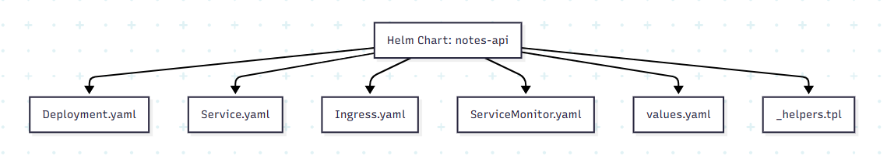
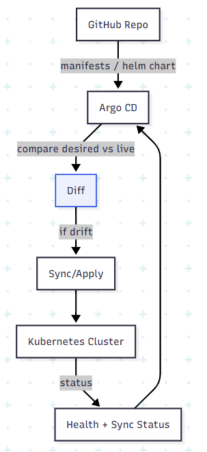
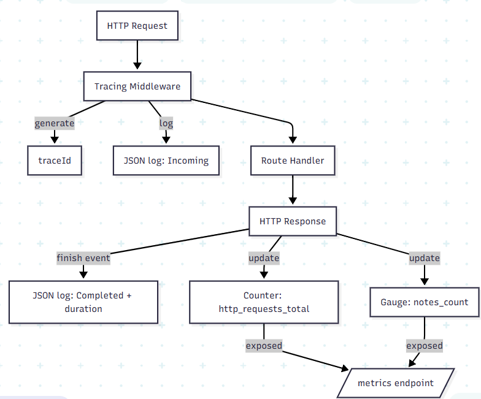
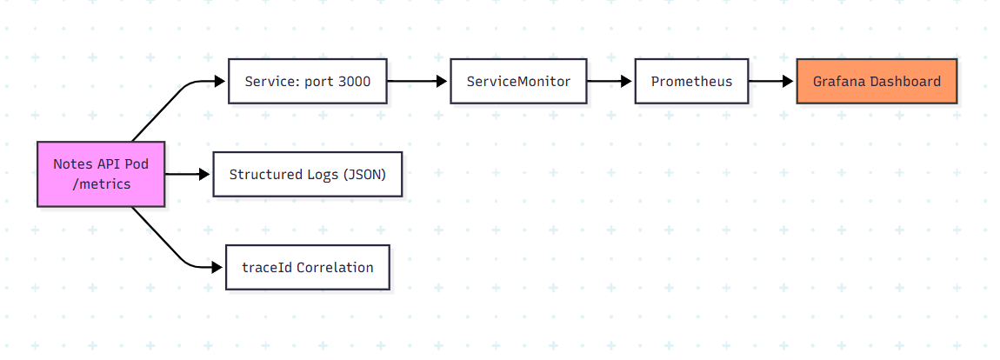
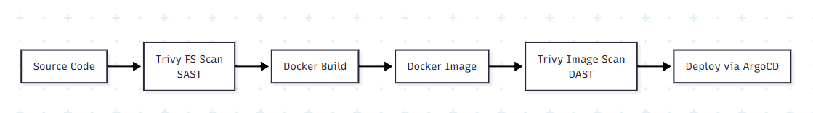
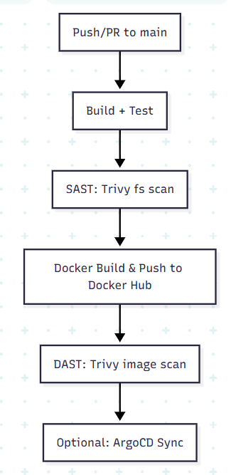

# 📝 Notes API – End-to-End DevOps Project

## 📌 Project Overview

This project demonstrates a **complete DevOps lifecycle** applied to a simple REST API.
The goal is to show how **code → build → scan → deploy → monitor → secure** are fully connected using modern DevOps tools.

The application is a lightweight **Node.js Notes API**, containerized with Docker, deployed on Kubernetes using Helm, synchronized via Argo CD (GitOps), monitored with Prometheus & Grafana, and secured with Trivy scans.

---

## 🎯 Objectives

* Build a small backend REST API (<150 LOC)
* Apply **CI/CD automation**
* Use **Docker & Kubernetes**
* Implement **GitOps with Argo CD**
* Add **observability** (metrics, logs, tracing)
* Add **security scans** (SAST & DAST)
* Provide **clear documentation and evidence**

---

## 🛠️ Technologies Used

| Category      | Tools                   |
| ------------- | ----------------------- |
| Language      | Node.js (Express)       |
| Container     | Docker                  |
| CI/CD         | GitHub Actions          |
| Security      | Trivy (FS & Image Scan) |
| Orchestration | Kubernetes (Minikube)   |
| Packaging     | Helm                    |
| GitOps        | Argo CD                 |
| Monitoring    | Prometheus              |
| Visualization | Grafana                 |
| Metrics       | prom-client             |
| Logging       | Structured JSON logs    |
| Tracing       | Request traceId         |

---

## 🏗️ Architecture Overview

### High-Level Flow

```
Developer → GitHub → GitHub Actions
              ↓
        Docker Image (Docker Hub)
              ↓
           Argo CD
              ↓
        Kubernetes (Minikube)
              ↓
     Prometheus ← ServiceMonitor
              ↓
           Grafana Dashboard
```

### Components

* **Notes API**: Node.js REST service
* **Docker Image**: Published to Docker Hub
* **Helm Chart**: Defines Deployment, Service, Ingress, ServiceMonitor
* **Argo CD**: Syncs Git state to cluster
* **Prometheus**: Scrapes `/metrics`
* **Grafana**: Visualizes metrics

---

## ☸️ Kubernetes Setup

### Namespaces

* `notes-api` → Application
* `monitoring` → Prometheus & Grafana
* `argocd` → GitOps controller


### Deployment

* 1 replica (configurable via Helm)
* Health checks: `/health`
* Security context (non-root container)

### Service

* `NodePort`
* Exposes port `3000`
* Used by Ingress and ServiceMonitor

### Ingress

* NGINX Ingress Controller
* Host-based routing (`notes-api.local`)

### Helm Chart Structure

```
helm/notes-api/
├── templates/
│   ├── deployment.yaml
│   ├── service.yaml
│   ├── ingress.yaml
│   ├── servicemonitor.yaml
│   └── _helpers.tpl
├── values.yaml
└── Chart.yaml
```

---


## 🔁 GitOps with Argo CD

* Argo CD watches the GitHub repository
* Automatically syncs Kubernetes manifests
* Shows real-time health and drift detection



### Access Argo CD UI

```bash
kubectl port-forward svc/argocd-server -n argocd 8080:443
```

➡️ Open: [https://localhost:8080](https://localhost:8080)

Get admin password:

```bash
kubectl -n argocd get secret argocd-initial-admin-secret \
-o jsonpath="{.data.password}" | base64 --decode
```

---

## 📊 Observability Stack

### Metrics

* Exposed at `/metrics`
* Collected using `prom-client`
* Examples:

  * `http_requests_total`
  * `notes_count`
  * CPU & Memory (from kube metrics)



### ServiceMonitor

Prometheus discovers the API using a custom `ServiceMonitor`:

```yaml
endpoints:
  - port: http
    path: /metrics
    interval: 10s
```


### Grafana Dashboard

* Custom dashboard (`notes-api-dashboard.json`)
* Panels:

  * Total HTTP requests
  * Request rate
  * Status codes
  * CPU usage
  * Memory usage
  * Notes count

Access Grafana:

```bash
kubectl port-forward svc/monitoring-grafana -n monitoring 3001:80
```

➡️ [http://localhost:3001](http://localhost:3001)

---

## 📜 Logs & Tracing

### Structured Logs

Logs are emitted as JSON:

```json
{
  "timestamp": "...",
  "traceId": "...",
  "message": "Incoming POST /notes"
}
```

### Live Logs

```bash
kubectl logs -f -n notes-api -l app.kubernetes.io/name=notes-api
```

### Tracing

* Each request has a unique `traceId`
* Allows correlation between logs and metrics

---

## 🔐 Security



### SAST – Static Scan

Scan source code before build:

```bash
trivy fs .
```

### DAST – Image Scan

Scan Docker image after build:

```bash
trivy image nouromry/notes-api:latest
```

### Why It Matters

* Prevents vulnerable dependencies
* Avoids shipping insecure images
* Meets DevSecOps best practices

---

## 🚀 CI/CD Pipeline (GitHub Actions)



### Pipeline Stages

1. **Build & Test**

   * Install dependencies
   * Run tests
2. **SAST Scan**

   * Trivy filesystem scan
3. **Build & Push Image**

   * Docker Buildx
   * Push to Docker Hub
4. **DAST Scan**

   * Trivy image scan

Pipeline file:

```
.github/workflows/ci-cd.yml
```

---

## 🧪 Running the Application Locally

### API Access

```bash
kubectl port-forward svc/notes-api-notes-api -n notes-api 3000:3000
```

Create a note:

```bash
curl -X POST http://localhost:3000/notes \
-H "Content-Type: application/json" \
-d '{"title":"Demo","content":"Hello DevOps"}'
```

---

## ✅ Results

* ✔ CI/CD pipeline passing
* ✔ Docker image published
* ✔ Kubernetes deployment healthy
* ✔ Argo CD synchronized
* ✔ Metrics visible in Grafana
* ✔ Logs streaming live
* ✔ Security scans executed

---

## 📚 Lessons Learned

* GitOps simplifies deployment management
* Observability is essential for debugging
* Security must be integrated early (Shift Left)
* Kubernetes + Helm brings consistency
* Real DevOps is about **automation + visibility**

---

## 🔮 Future Improvements

* Add alerting rules (Prometheus Alerts)
* Add OpenTelemetry tracing
* Deploy to cloud Kubernetes (EKS/GKE)
* Add authentication to the API
* Improve test coverage

---

## 👤 Author

**Name:** Nouromry
**Project:** DevOps Individual Project
**Repository:** `notes-api-devops`

---
